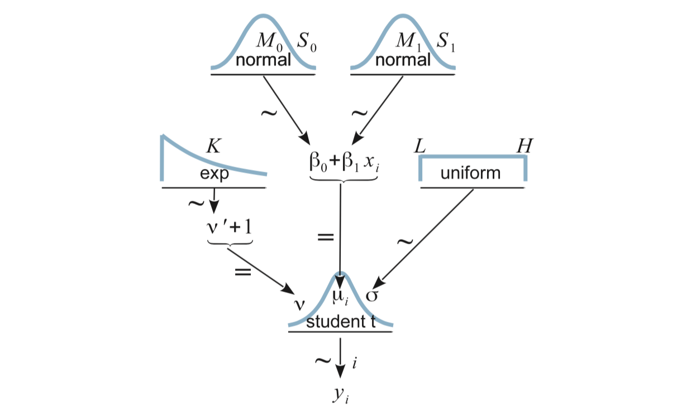

# Simple Linear Regression

```{r ch17-setupt, include = FALSE}
options(width = 100)
```

Situation:

* Metric response
* Matric predictor

## The deluxe basic model

### Likelihood

\begin{align*}
y_{i} &\sim {\sf Norm}(\mu_i, \sigma) \\
\mu_i &\sim \beta_0 + \beta_1 x_i
\end{align*}

Variations:
  
  * Replace normal distribution with something else (t is common).
  * Allow standard deviations to vary with $x$ as well as the mean.

The first variation is sometimes called **robust regression** becuase it
is more robust to unusual observations.  Since it is no harder to work 
with t distributions than with normal distributions, that will become our
go-to simple linear regression model.

\begin{align*}
y_{i} &\sim {\sf T}(\mu_i, \sigma, \nu) \\
\mu_i &\sim \beta_0 + \beta_1 x_i
\end{align*}

```{r ch17-diagram, echo = FALSE, fig.align = "center"}

```

### Priors

We need priors for $\beta_0$, $\beta_1$, $\sigma$, and $\nu$.

* $\nu$: We've already seend that a Gamma with mean around 30 works well
as a generic prior giving the data room to stear us away from normality
if warranted.

* $\beta_1$:  The MLE for $\beta_1$ is 

    $$ \hat\beta_1 = r \frac{SD_y}{SD_x}$$
    so it makes sense to have a prior broadly covers
    the interval $(- \frac{SD_y}{SD_x}, \frac{SD_y}{SD_x})$.

* $\beta_0$: The MLE for $\beta_0$ is 

    $$ \hat\beta_0 \; = \;  \overline{y} - \hat \beta_1 \overline{x}  \; = \; \overline{y} - r \frac{SD_y}{SD_x} \cdot \overline{x}$$
    
    so we can pick a prior that broadly covers the interval
    $(\overline{y} - \frac{SD_y}{SD_x} \cdot \overline{x}, \overline{y} - \frac{SD_y}{SD_x} \cdot \overline{x})$
    
* $\sigma$ measure the amount of variability in responses for a 
*fixed value* of $x$ (and is assumed to be the same for each $x$ in
the simple version of the model). A weakly informative prior
should cover the range of reasonable values of $\sigma$ with plenty of
room to spare.  (Our 3-orders-of-magnititude-either-way uniform distribution
might be a reasonable starting point.)

## Example: Galton's Data

Since we are looking at regression, let's use a historical data set that
was part of the origins of the regression story: Galton's data on height.
Galton collected data on the heights of adults and their parents.

```{r ch17-galton-look}
head(mosaicData::Galton)
```

To keep things simpler for the moment, let's consider only women, and only one
sibling per family.

```{r ch17-galton-women}
set.seed(54321)
library(dplyr)
GaltonW <-
  mosaicData::Galton %>% 
  filter(sex == "F") %>%
  group_by(family) %>%
  sample_n(1)
```

Galton was interested in how people's heights are related to their parents'
heights. He compbined the parents' heights into the "mid-parent height", which
was the average of the two.

```{r ch17-midparent}
GaltonW <- 
  GaltonW %>%
  mutate(midparent = (father + mother) / 2)
gf_point(height ~ midparent, data = GaltonW)
```

### Describing the model to JAGS

```{r ch17-galton-model}
galton_model <- function() {
  for (i in 1:length(y)) {
    y[i]   ~ dt(mu[i], 1/sigma^2, nu)
    mu[i] <- beta0 + beta1 * x[i]
  }
  sigma ~ dunif(6/100, 6 * 100)
  nuMinusOne ~ dexp(1/29)
  nu <- nuMinusOne + 1
  beta0 ~ dnorm(0, 1/100^2)   # 100 is order of magnitude of data
  beta1 ~ dnorm(0, 1/4^2)     # expect roughly 1-1 slope
}
```

```{r ch17-galton-jags, results = "hide", cache = TRUE}
library(R2jags)
library(mosaic)
galton_jags <-
  jags(
    model = galton_model,
    data = list(y = GaltonW$height, x = GaltonW$midparent),
    parameters.to.save = c("beta0", "beta1", "sigma", "nu"),
    n.iter = 5000,
    n.burnin = 2000,
    n.chains = 4,
    n.thin = 1
  )
```

```{r ch17-galton-summary, fig.height = 5}
library(bayesplot)
library(CalvinBayes)
summary(galton_jags)
mcmc_combo(as.mcmc(galton_jags))
```

### Problems and how to fix them

Clearly something is not working the way we would like with this model!
Here's a clue as to the problem:

```{r ch17-galton-problems}
posterior(galton_jags) %>% 
  gf_point(beta0 ~ beta1, color = ~ chain, alpha = 0.2, size = 0.4) %>%
  gf_density2d(alpha = 0.5)
posterior(galton_jags) %>% filter(iter <= 250, chain == "chain:1") %>%
  gf_step(beta0 ~ beta1, alpha = 0.8, color = ~iter) %>%
  gf_density2d(alpha = 0.2) %>%
  gf_refine(scale_color_viridis_c()) %>%
  gf_facet_wrap(~chain) #, scales = "free")
```

The correlation of the parameters in the posterior distribution produces a 
long, narrow, diagonal ridge that the Gibbs sampler samples only very slowly
because it keeps bumping into edge of the cliff.  (Remember, the Gibbs sampler
only moves in "primary" directions.)

So how do we fix this?
This is supposed to be the *simple* linear model after all.
There are two ways we could hope to fix our problem.

1. **Reparameterize the model** so that the correlation between parameters 
(in the posterior distribution) is reduced or eliminated.

2. **Use a different algorithm** for posterior sampling. The problem is 
not with our model *per se*, rather it is with the method we are using (Gibbs)
to sample from the posterior.  Perhaps another algorithm will work
better.

## Centering and Standardizing


* Reparameterization 1:  **centering**
   
    We can express this model as 
    
    \begin{align*}
    y_{i} &\sim {\sf T}(\mu_i, \sigma, \nu) \\
    \mu_i &= \alpha_0 + \alpha_1 (x_i - \overline{x})
    \end{align*}
    
    Since 
    
    \begin{align*}
    \alpha_0 + \alpha_1 (x_i - \overline{x}) 
    &= (\alpha_0 - \alpha_1 \overline{x}) + \alpha_1 x_i 
    \end{align*}

    We see that $\beta_0 = \alpha_0 - \alpha_1 \overline{x}$ and
    $\beta_1 = \alpha_1$. So we can easily recover the original 
    parameters if we like.  (And if we are primarily interested in $\beta_1$,
    no translation is required.)  
    
    This reparameterization maintains the natural scale of the data, and both
    $\alpha_0$ and $\alpha_1$ are easily interpreted: $\alpha_0$ is the mean
    response when the predictor is the average of the predictor values *in the data*.
    
    
* Reparameterization 2: **standardization**
    
    We can also express our model as
    
    \begin{align*}
    z_{y_{i}} &\sim {\sf T}(\mu_i, \sigma, \nu) \\[3mm]
    \mu_i     &= \alpha_0 + \alpha_1 z_{x_i} \\[5mm]
    z_{x_i}   &=    \frac{x_i - \overline{x}}{SD_x} \\[3mm]
    z_{y_i}   &=    \frac{y_i - \overline{y}}{SD_y} \\[3mm]
    \end{align*}
    
    Here the change in the model is due to a transformation of the data.  Subtracting the mean
    and dividing by the standard deviation is called **standardization**, and the values
    produced are sometimes called **z-scores**. The resulting distributions of $zy$ and $zx$
    will have mean 0 and standard deviation 1. So in addition to breaking the correlation
    pattern, we have now put things on a standard scale, regardless of what the original
    units were. This can be useful for picking constants in priors (we won't have to estimate
    the scale of the data involved). In addition, some algorithms work better if all the
    variables involved have roughly the same scale.
    
    The downside is that we usually need to convert back to the original scales of 
    $x$ and $y$ in  order to interpret the results. But this is only a matter
    of a little easy algebra:
    
    \begin{align*} 
    \hat{z}_{y_i} &= \alpha_0 + \alpha_1 z{x_i}
    \\
    \frac{\hat{y}_i - \overline{y}}{SD_y} &= \alpha_0 + \alpha_1 \frac{x_i - \overline{x}}{SD_x}
    \\
    \hat{y}_i &= \overline{y} + \alpha_0 SD_y + \alpha_1 SD_y \frac{x_i - \overline{x}}{SD_x}
    \\
    \hat{y}_i &= 
    \underbrace{\left[\overline{y} + \alpha_0 SD_y - \alpha_1\frac{SD_y}{SD_x} \overline{x} \right]}_{\beta_0} + 
    \underbrace{\left[\alpha_1 \frac{SD_y}{SD_x}\right]}_{\beta_1} x_i
    \end{align*}

Since Kruscske demonstrates standardization, we'll do centering here.

```{r ch17-galton-jags-centering, results = "hide", cache = TRUE}
galtonC_model <- function() {
  for (i in 1:length(y)) {
    y[i]   ~ dt(mu[i], 1/sigma^2, nu)
    mu[i] <- alpha0 + alpha1 * (x[i] - mean(x))
  }
  sigma ~ dunif(6/100, 6 * 100)
  nuMinusOne ~ dexp(1/29)
  nu <- nuMinusOne + 1
  alpha0 ~ dnorm(0, 1/100^2)   # 100 is order of magnitude of data
  alpha1 ~ dnorm(0, 1/4^2)     # expect roughly 1-1 slope
  beta0 = alpha0 - alpha1 * mean(x)
  beta1 = alpha1               # not necessary, but gives us both names
}
galtonC_jags <-
  jags(
    model = galtonC_model,
    data = list(y = GaltonW$height, x = GaltonW$midparent),
    parameters.to.save = c("beta0", "beta1", "alpha0", "alpha1", "sigma", "nu"),
    n.iter = 5000,
    n.burnin = 2000,
    n.chains = 4,
    n.thin = 1
  )
```


```{r ch17-galton-centering-look, fig.height = 7}
summary(galtonC_jags)
mcmc_combo(as.mcmc(galtonC_jags))
```

Ah! That looks much better than before.

## We've fit a model, now what?

After centering or standardizing, JAGS works much better. We can now sample from
our posterior distribution. But what do we do with our posterior samples?


### Estimate parameters

If we are primarily interested in a regression parameter 
(usually the slope parameter is much more interesting than the intercept 
parameter), we can use an HDI to express our estimate.

```{r ch17-galtonC-estimate-params}
hdi(posterior(galtonC_jags), pars = "beta1")
mcmc_areas(as.mcmc(galtonC_jags), pars = "beta1", prob = 0.95)
```

Galton noticed what we see here: that the slope is less than 1. This means that
children of taller than average parents tend to be shorter than their parents
and children of below average parents tend to be taller than their parents.
He referred to this in his paper as 
["regression towards mediocrity"](http://www.stat.ucla.edu/~nchristo/statistics100C/history_regression.pdf). As it turns out, this was not a special feature
of the heridity of heights but a general feature of linear models.


### Make predictions

Suppse we know the heights of a father and mother, from which we compute
ther mid-parent height $x$. 
How tall would we predict their daughters will be as adults? 
Each posterior sample provides an answer
by describing a t distribution with `nu` degrees of freedom, 
mean $\beta_0 + \beta_1 x$, and standard deviation $\sigma$.

The posterior distribution of the average hieght of daughters born 
to parents with midparent height $x = 70$ is shown below, along 
with an HDI.

```{r ch17-galtonC-preditions}
posterior(galtonC_jags) %>% 
  mutate(mean_daughter = beta0 + beta1 * 70) %>%
  gf_dens(~mean_daughter)
Galton_hdi <-
  posterior(galtonC_jags) %>% 
  mutate(mean_daughter = beta0 + beta1 * 70) %>%
  hdi(pars = "mean_daughter")
Galton_hdi
``` 

So on average, we would predict the daughters to be about
66 or 67 inches tall.

We can visualize this by drawing a line for each posterior sample.
The HDI should span the middle 95% of these.

```{r ch17-galtonC-showlines}
gf_abline(intercept = ~beta0, slope = ~beta1, alpha = 0.01,
          color = "steelblue", 
          data = posterior(galtonC_jags) %>% sample_n(2000)) %>%
  gf_point(height ~ midparent, data = GaltonW, inherit = FALSE) %>%
  gf_errorbar(lo + hi ~ 70, data = Galton_hdi, color = "skyblue", 
              width = 0.2, size = 1.2, inherit = FALSE)
```

But this may not be the sort of prediction we want. Notice that most daughters'
heights are not in the blue band in the picture. That band tells about
the *mean* but doesn't take into account how much individuals vary about 
that mean.  We can add that information in by taking our estimate for 
$\sigma$ into account.

Here we generate heights by adding noise to the estimate given by 
values of $\beta_0$ and $\beta_1$.

```{r ch17-galtonC-plot-predictions}
posterior(galtonC_jags) %>% 
  mutate(new_ht = beta0 + beta1 * 70 + rt(1200, df = nu) * sigma) %>%
  gf_point(new_ht ~ 70, alpha = 0.01, size = 0.7, color = "steelblue") %>%
  gf_point(height ~ midparent, data = GaltonW, inherit = FALSE) 
```

```{r ch17-galtonC-predinterval}
Galton_hdi2 <-
  posterior(galtonC_jags) %>% 
  mutate(new_ht = beta0 + beta1 * 70 + rt(1200, df = nu) * sigma) %>%
  hdi(regex_pars = "new") 
Galton_hdi2
```

So our model expects that most daughters whose parents have a midparent height 
of 70 inches are between  
`r round(Galton_hdi2$lo, 1)` and
`r round(Galton_hdi2$hi, 1)` 
inches tall. Notice that this interval
is taking into account both the uncertainty in our estimates of the
parameters $\beta_0$, $\beta_1$, $\sigma$, and $\nu$ and the variability in 
heights that $\sigma$ and $\nu$ indicate.

With a little more work, we can create intervals like this at several different
midparent heights.

```{r ch17-galtonC-ppc}
Post_galtonC <- posterior(galtonC_jags)

Grid <- 
  expand.grid(midparent = 60:75, iter = 1:nrow(Post_galtonC)) 
 
posterior(galtonC_jags) %>%
  mutate(noise = rt(12000, df = nu)) %>%
  left_join(Grid) %>%
  mutate(height = beta0 + beta1 * midparent + noise * sigma) %>% 
  group_by(midparent) %>%
  do(hdi(., pars = "height")) 

posterior(galtonC_jags) %>%
  mutate(noise = rt(12000, df = nu)) %>%
  left_join(Grid) %>%
  mutate(avg_height = beta0 + beta1 * midparent,
         height = avg_height + noise * sigma) %>% 
  group_by(midparent) %>%
  do(hdi(., pars = "height")) %>%
  gf_ribbon(lo + hi ~ midparent, fill = "steelblue", alpha = 0.2) %>%
  gf_errorbar(lo + hi ~ midparent, width = 0.2, color = "steelblue", size = 1.2) %>%
  gf_point(height ~ midparent, data = GaltonW, inherit = FALSE)
```

Comparing the data to the posterior predictions of the model is called a 
**posterior predictive check**; we are checking to see whether the data 
are consistent with what our posterior distribution would predict.
In this case, things look good: most, but not all of the data is falling
inside the band where our models predicts 95% of new observations would 
fall.

If the posterior predictive check indicates systematic problems with our model,
it may lead us to propose another (we hope better) model.

## Fitting models with Stan

Centering (or standardizing) is sufficient to make JAGS efficient enough to use.
But we can also use Stan, and since Stan is not bothered by correlation in the
posterior the way JAGS is, Stan works well even without reparamterizing the model.


## Exercises

1. Use Galton's data on the men to estimate 

    a. The average of height of men whose parents are 65 and 72 inches tall.
    b. The middle 50% of heights of men whose parents are 65 and 72 inches tall.