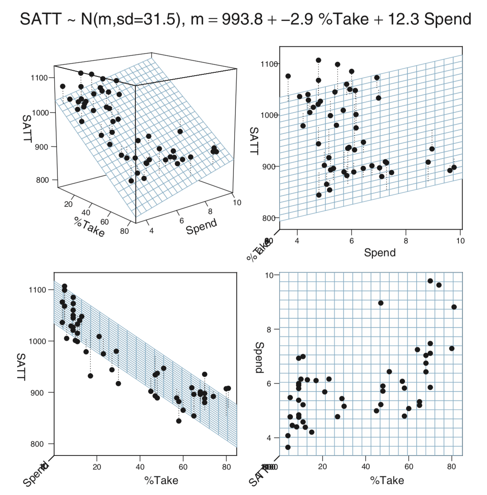

# Multiple Metric Predictors


## SAT

### SAT vs expenditure

Does spending more on education result in higher SAT scores?  Data from 1999
(published in a paper by Gruber) can be used to explore this question. Among other
things, the data includes average total SAT score (on a 400-1600 scale) and 
the amount of money spent on education (in 1000s of dollars per student) in each state.

As a first attempt, we could fit a linear model (sat ~ expend).  Using centering, the 
core of the model looks like this:

```
  for (i in 1:length(y)) {
    y[i]   ~ dt(mu[i], 1/sigma^2, nu)
    mu[i] <- alpha0 + alpha1 * (x[i] - mean(x))
  }
```

`alpha1` measures how much better SAT performance is for each $1000 spent
on education in a state. To fit the model, we need priors on our four 
parameters:

* `nu`: We can use our usual shifted exponential.
* `sigma`:  {\sf Unif}(?, ?) 
* `alpha0`: {\sf Norm}(?, ?)
* `alpha1`: {\sf Norm}(0, ?)

The question marks depend on the scale of our variables. 
If we build those into our model, and provide the answers as part of our data,
we can use the same model for multiple data sets, even if they are at different
scales.

```{r ch18-setup, include = FALSE}
options(width = 100)
library(brms)
library(CalvinBayes)
```


```{r ch18-sat1-model}
sat_model <- function() {
  for (i in 1:length(y)) {
    y[i]   ~ dt(mu[i], 1/sigma^2, nu)
    mu[i] <- alpha0 + alpha1 * (x[i] - mean(x))
  }
  nuMinusOne ~ dexp(1/29.0)
  nu        <- nuMinusOne + 1
  alpha0     ~ dnorm(alpha0mean, 1 / alpha0sd^2) 
  alpha1     ~ dnorm(0, 1 / alpha1sd^2)
  sigma      ~ dunif(sigma_lo, sigma_hi * 1000)
  log10nu   <- log(nu) / log(10)    # log10(nu)
  beta0     <- alpha0 - mean(x) * alpha1          # true intercept
}
```


So how do we fill in the question marks for this data set?

* `sigma`: {\sf Unif}(?,?)

    This quantifies the amount of variation from state to state among states
    that have the same per student expenditure. The scale of the SAT ranges from 
    400 to 1600. Statewide averages will not be near the extremes of this scale.
    A 6-order of maginitude window around 1 gives **{\sf Unif}(0.001, 1000)**, 
    both ends of which are plenty far from what we think is reasonable.

* `alpha0`: {\sf Norm}(?, ?)

    `alpha0` measures the average SAT score for states that spend an average
    amount. Since average SATs are around 1000, something like 
    **{\sf Norm}(1000, 100)** seems reasable.  
    
* `alpha1`: {\sf Norm}(0, ?)

    This is the trickiest one.  The slope of a regression line can't be much more than
    $\frac{SD_y}{SD_x}$, so we can either estimate that ratio or compute it from 
    our data to guide our choice of prior.

    

```{r ch18-sat1-jags, results = "hide"}
library(R2jags)
sat_jags <- 
  jags(
    model = sat_model,
    data = list(
      y = SAT$sat,
      x = SAT$expend,
      alpha0mean = 1000,    # SAT scores are roughly 500 + 500
      alpha0sd   = 100,     # broad prior on scale of 400 - 1600
      alpha1sd   = 4 * sd(SAT$sat) / sd(SAT$expend),
      sigma_lo = 0.001,     # 3 o.m. less than 1
      sigma_hi = 1000       # 3 o.m. greater than 1
    ),
    parameters.to.save = c("nu", "log10nu", "alpha0", "beta0", "alpha1", "sigma"),
    n.iter   = 4000,
    n.burnin = 1000,
    n.chains = 3
  ) 
```

```{r ch18-sat1-jags-look, fig.height = 5}
sat_jags
diag_mcmc(as.mcmc(sat_jags))
mcmc_combo(as.mcmc(sat_jags))
```

Our primary interest is `alpha1`.

```{r ch18-sat-alpha, fig.height = 4}
summary_df(sat_jags) %>% filter(param == "alpha1")
plot_post(posterior(sat_jags)$alpha1, xlab = "alpha1", ROPE = c(-5, 5))
hdi(posterior(sat_jags), pars = "alpha1", prob = 0.95)
```

This seems odd: Nearly all the credible values for `alpha1` are negative? 
Can we really raise SAT scores by cutting funding to schools? Maybe we should look
at the raw data with our model overlaid.

```{r ch18-sat-scatter}
gf_point(sat ~ expend, data = SAT) %>%
  gf_abline(slope = ~ alpha1, intercept = ~ beta0, 
            data = posterior(sat_jags) %>% sample_n(2000),
            alpha = 0.01, color = "steelblue")
```

That's a lot of scatter, and the negative trend is heavily influenced by the 4 states that 
spend the most (and have relatively low SAT scores).  We could do a bit more with 
this model, for exapmle we could
  
    * fit without those 4 states to see how much they are driving the negative trend;
    * do some PPC to see if the model is reasonable.

But instead will will explore another model, one that has two predictors.


### SAT vs expenditure and percent taking the test

We have some additional data about each state.  Let's fit a model with two 
predictors: `expend` and `frac`.

```{r ch18-SAT-head}
SAT %>% head(4)
```

Here's our model for (robust) multiple linear regression:

```{r ch18-fig4, echo = FALSE, fig.align = "center"}
knitr::include_graphics("images/Fig18-4.png")
```

#### JAGS {#sat2-jags}

Coding it in JAGS requires adding in the additional predictor:

```{r ch18-sat2-model}
sat_model2 <- function() {
  for (i in 1:length(y)) {
    y[i]   ~ dt(mu[i], 1/sigma^2, nu)
    mu[i] <- alpha0 + alpha1 * (x1[i] - mean(x1)) + alpha2 * (x2[i] - mean(x2))
  }
  nuMinusOne ~ dexp(1/29.0)
  nu        <- nuMinusOne + 1
  alpha0     ~ dnorm(alpha0mean, 1 / alpha0sd^2) 
  alpha1     ~ dnorm(0, 1 / alpha1sd^2)
  alpha2     ~ dnorm(0, 1 / alpha2sd^2)
  sigma      ~ dunif(sigma_lo, sigma_hi * 1000)
  beta0     <- alpha0 - mean(x1) * alpha1 - mean(x2) * alpha2
  log10nu   <- log(nu) / log(10)
}
```

```{r ch18-sat2-jags, results = "hide"}
library(R2jags)
sat2_jags <- 
  jags(
    model = sat_model2,
    data = list(
      y = SAT$sat,
      x1 = SAT$expend,
      x2 = SAT$frac,
      alpha0mean = 1000,    # SAT scores are roughly 500 + 500
      alpha0sd   = 100,     # broad prior on scale of 400 - 1600
      alpha1sd   = 4 * sd(SAT$sat) / sd(SAT$expend),
      alpha2sd   = 4 * sd(SAT$sat) / sd(SAT$frac),
      sigma_lo = 0.001,
      sigma_hi = 1000
    ),
    parameters.to.save = c("log10nu", "alpha0", "alpha1", "alpha2", "beta0","sigma"),
    n.iter   = 4000,
    n.burnin = 1000,
    n.chains = 3
  ) 
```

```{r ch18-sat2-jags-look, fig.height = 5}
sat2_jags
diag_mcmc(as.mcmc(sat2_jags))
mcmc_combo(as.mcmc(sat2_jags))
```

```{r ch18-sat2-alpha1, fig.height = 4}
summary_df(sat2_jags) %>% filter(param == "alpha1")
plot_post(posterior(sat2_jags)$alpha1, xlab = "alpha1", ROPE = c(-5, 5))
hdi(posterior(sat2_jags), pars = "alpha1", prob = 0.95)
```

```{r ch18-sat2-alpha2, fig.height = 4}
summary_df(sat2_jags) %>% filter(param == "alpha2")
plot_post(posterior(sat2_jags)$alpha2, xlab = "alpha2")
hdi(posterior(sat2_jags), pars = "alpha2", prob = 0.95)
```


### What's wrong with this picture?

```{r ch18-sat2-scatter}
gf_point(sat ~ expend, data = SAT) %>%
  gf_abline(slope = ~ alpha1, intercept = ~ beta0, 
            data = posterior(sat2_jags) %>% sample_n(2000),
            alpha = 0.01, color = "steelblue")
```


### Multiple predictors in pictures

Interpretting coefficients in a model with multiple predictors is less straightforward
that it is in a model with one predictor if those predictors happen to be 
correlated, as they are in the case of the SAT example above:

```{r ch18-x1x2-scatter}
gf_point(expend ~ frac, data = SAT) 
```

#### If the predictors are uncorrelated

Let's start with the easier case when the predictors are not correlated.


```{r ch18-fig1, echo = FALSE, fig.align = "center"}
knitr::include_graphics("images/Fig18-1.png")
```

#### Correlated predictors

```{r ch18-fig2, echo = FALSE, fig.align = "center"}
knitr::include_graphics("images/Fig18-2.png")
```

#### SAT model

```{r ch18-fig3, echo = FALSE, fig.align = "center"}

```


#### So how do we interpret?


Interpreting the parameters of a multiple regression model
is a bit more subtle than it was for simple linear regression
where $\beta_0$ and $\beta_1$ could be interpreted as 
the intercept and slope of a linear relationship between
the response and the predictor.  
It is tempting to interpret $\beta_i$
as how much the response increases (on average) 
if $x_i$ is increased by $1$ 
\emph{and the other predictors are not changed}, but this 
does not correctly take into account the other variables
in the regression.  Tukey described the coefficients 
of a multiple regression model this way:
$\beta_i$ tells how the response ($Y$) responds to change
in $x_i$ 
``after adjusting for simultaneous linear change in the other predictors 
in the data at hand" (Tukey, 1970, Chapter 23).
More recently, Hoaglin (Hoaglin, 2016) has written about the 
perils of the ``all other predictors held constant" misunderstanding of 
coefficients in multiple regression.

We will continue to refine the interpretation of multiple regression coefficients
as we see examples, but we can already give some reasons
why the ``all other variables being held constant" interpretation fails.
In many situations, it really isn't possible to adjust one predictor without
other predictors simultaneously changing.  Imagine, for example, an economic 
model that includes predictors like inflation rate, interest rates, unemployment
rates, etc.  A government can take action to affect a variable like interest
rates, but that may result in changes to the other predictors as well.

When predictor variables are correlated, interpretation can become subtle.
For example, if $x_1$ and $x_2$ are negatively correlated and 
$\beta_1$ and $\beta_2$ are both positive, it is possible that an increase $x_1$
could be associated with a \emph{decrease} in $Y$ because as $x_1$ increases, 
$x_2$ will tend to decrease, and the negative influence on $Y$ from the decrease in
$x_2$ could be larger than the positive influence on $Y$ from the increase
in $x_1$.  In this situation, $\beta_1 > 0$ indicates that \emph{after
we adjust for simultaneous changes in $x_2$} (which in this example are associated
with a decrease in $Y$), $Y$ tends to increase as $x_1$ increases.

##### Flights example

In his 2016 eCOTS presentation \cite{Gelman:ecots2016}, Andrew Gelman
discussed a paper \cite{DeCelles:2016} that used models with several
predictors to study the causes of air rage (upset passengers on commercial
airlines).  Among the regressors were things like the presence of 
first class seats, whether passengers boarded from the front, size of 
the aircraft, length of the flight, whether the flight was international,
physical characteristics of economy and first class seats,
and several others.  Among the conclusions of the paper were these:
``Physical inequality on airplanes -- that is, the presence of a first 
class cabin -- is associated with more frequent air rage incidents in 
economy class. Situational inequality -- boarding from the front (requiring 
walking through the first class cabin) versus the middle of the plane -- 
also significantly increases the odds of air rage in both economy and first 
class. We show that physical design that highlights inequality can trigger 
antisocial behavior on airplanes."

But since front-boarding planes with first class compartments tend to 
be larger, and take longer flights, one must be very careful to avoid
a ``while holding all other variables fixed" interpretation.


## Interaction

The model above could be called a ``parallel slopes" model since we can rewrite

\begin{align*}
y &= \beta_0 + \beta_1 x_1 + \beta_2 x_2 + \mathrm{noise} \\
y &= (\beta_0 + \beta_1 x_1) + \beta_2 x_2 + \mathrm{noise} \\
y &= (\beta_0 + \beta_2 x_2) + \beta_1 x_1 + \mathrm{noise}
\end{align*}

So the slope of $y$ with respect to $x_i$ is constant, no matter what value the
other predictor has.  (The intercept changes as we change the other predictor, however.)

If we want a model that allows the slopes to also change with the other predictor, we can
add in an interaction term:

\begin{align*}
y &= \beta_0 + \beta_1 x_1 + \beta_2 x_2 + \beta_3 x_1 x_2 \mathrm{noise} \\
y &= (\beta_0 + \beta_1 x_1) + (\beta_2 + \beta_3 x_1) x_2 + \mathrm{noise} \\
y &= (\beta_0 + \beta_2 x_2) + (\beta_1 + \beta_3 x_2) x_1\mathrm{noise}
\end{align*}

### SAT with interaction term
 
```{r ch18-sat3-model}
sat_model3 <- function() {
  for (i in 1:length(y)) {
    y[i]   ~ dt(mu[i], 1/sigma^2, nu)
    mu[i] <- alpha0 + alpha1 * (x1[i] - mean(x1)) + alpha2 * (x2[i] - mean(x2)) +  alpha3 * (x3[i] - mean(x3))
  }
  nuMinusOne ~ dexp(1/29.0)
  nu        <- nuMinusOne + 1
  alpha0     ~ dnorm(alpha0mean, 1 / alpha0sd^2) 
  alpha1     ~ dnorm(0, 1 / alpha1sd^2)
  alpha2     ~ dnorm(0, 1 / alpha2sd^2)
  alpha3     ~ dnorm(0, 1 / alpha3sd^2)
  sigma      ~ dunif(sigma_lo, sigma_hi)
  beta0     <- alpha0 - mean(x1) * alpha1 - mean(x2) * alpha2
  log10nu   <- log(nu) / log(10)
}
```

#### JAGS {#sat3-jags} 

```{r ch18-sat3-jags, results = "hide"}
library(R2jags)
sat3_jags <- 
  jags(
    model = sat_model3,
    data = list(
      y = SAT$sat,
      x1 = SAT$expend,
      x2 = SAT$frac,
      x3 = SAT$frac * SAT$expend,
      alpha0mean = 1000,    # SAT scores are roughly 500 + 500
      alpha0sd   = 100,     # broad prior on scale of 400 - 1600
      alpha1sd   = 4 * sd(SAT$sat) / sd(SAT$expend),
      alpha2sd   = 4 * sd(SAT$sat) / sd(SAT$frac),
      alpha3sd   = 4 * sd(SAT$sat) / sd(SAT$frac * SAT$expend),
      sigma_lo = 0.001,
      sigma_hi = 1000
    ),
    parameters.to.save = c("log10nu", "alpha0", "alpha1", "alpha2", "alpha3", "beta0","sigma"),
    n.iter   = 20000,
    n.burnin = 1000,
    n.chains = 3
  ) 
```

```{r ch18-sat3-jags-look, fig.height = 7}
sat3_jags
diag_mcmc(as.mcmc(sat3_jags))
mcmc_combo(as.mcmc(sat3_jags))
mcmc_pairs(as.mcmc(sat3_jags), regex_pars = "alpha")
```

## Fitting a linear model with brms

The brms package provides a simplified way of describing generalized linear models 
and fitting them with Stan.  The `brm()` function turns a terse description of the model
into Stan code, compiles it, and runs it.  Here's a linear model with `sat` as response, and
`expend`, `frac`, and an interaction as predictors.  (The `*` means include the interaction
term.  If we used `+` instead, we would not get the interaction term.)


```{r ch18-brms, cache = TRUE, results = "hide"}
library(brms)  
sat3_brm <- brm(sat ~ expend * frac, data = SAT)
sat3_stan <- stanfit(sat3_brm)
```

Stan handles the correlated parameters a bit better than JAGS 
(but also takes a bit longer to compile and run for simple models).

```{r ch18-sat3-brms-look, fig.height = 7}
sat3_stan
mcmc_combo(as.mcmc.list(sat3_stan))
```

We can use `stancode()` to extract the Stan code used to fit the model.

```{r ch18-sat3-code}
brms::stancode(sat3_brm)
```

Some comments on the code

```
data { 
  int<lower=1> N;  // total number of observations 
  vector[N] Y;     // response variable 
  int<lower=1> K;  // number of population-level effects 
  matrix[N, K] X;  // population-level design matrix 
  int prior_only;  // should the likelihood be ignored? 
} 
```

```
transformed data { 
  int Kc = K - 1; 
  matrix[N, K - 1] Xc;    // centered version of X 
  vector[K - 1] means_X;  // column means of X before centering 
  for (i in 2:K) { 
    means_X[i - 1] = mean(X[, i]); 
    Xc[, i - 1] = X[, i] - means_X[i - 1]; 
  } 
} 
```

* The design matrix `X` has a column of 1's followed by a column for each predictor.
* `K` is the number of coluns in the design matrix.
* `Xc` omits the column of 1's and centers the other predictors by subtracting their means. 
    * `Kc` is the number of columns in this matrix (so it is one less than `K`)
    * the compuation of `Xc` happens in the for loop, which starts at 2 to omit that first column
    of 1's.
* We can use `standata()` to show the data `brm()` passes to Stan.

```{r ch18-sat3-standata}
standata(sat3_brm) %>% 
  lapply(head)  # truncte the output to save some space
```

```
parameters { 
  vector[Kc] b;  // population-level effects 
  real temp_Intercept;  // temporary intercept 
  real<lower=0> sigma;  // residual SD 
} 
```

* `b` is equivalent to 
$\langle \alpha_1, \alpha_2, \alpha_3 \rangle$ 
(which is the same as $\langle \beta_1, \beta_2, \beta_3 \rangle$).
* `temp_Intercept` is equivalent to $\alpha_0$.
* `sigma` is just as it has been in our previous models.

```
model { 
  vector[N] mu = temp_Intercept + Xc * b;
  // priors including all constants 
  target += student_t_lpdf(temp_Intercept | 3, 946, 85); 
  target += student_t_lpdf(sigma | 3, 0, 85)
    - 1 * student_t_lccdf(0 | 3, 0, 85); 
  // likelihood including all constants 
  if (!prior_only) { 
    target += normal_lpdf(Y | mu, sigma);
  } 
} 
```
* `target` is the main thing being calculated -- typically the log of the posterior, but there
is an option to compute the log of the prior instead by setting `prior_only` to true. You can see
that setting `prior_only` true omits the likelihood portion.
* The parts of the log posterior are added together using `+=`.  This is equivalent to multiplying
on the non-log scale.  The first two lines handle the prior; the third line, the likelihood.
* `student_t_lpdf()` is the log of the pdf of a t distribution. (Notice how this function
uses `|` to separate its main input from the parameters).
* The priors for `temp_Intercept` and `sigma` are t distributions with 3 degrees of freedom.
(The `brm()` wrapper function must be using the data to suggest $\mu$ and $\sigma$ where needed.
This is much like the order of magnitude reasoning we have been doing.)
* It appears that there are components of the prior for `temp_Intercept` and for `sigma`, 
but not for `b`.  This means that the log-prior for `b` is 0, so the prior is 1. That is,
the default in brms is to use an improper flat prior (1 everywhere). We'll see how to adjust
that momentarily.
* `- 1 * student_t_lccdf(0 | 3, 0, 85)` is adding a normalizing constant to the prior (and hence to
the posterior).
* `normal_lpdf()` indicates that this model is using normal noise.

```
generated quantities { 
  real b_Intercept = temp_Intercept - dot_product(means_X, b); 
} 
```

* This recovers the ``actual" intercept. It is equivalent to

\begin{align*}
\beta_0 &= \alpha_0 - \langle \overline{x}_{1}, \overline{x}_{2}, \overline{x}_{3} \rangle \cdot
\langle \alpha_1, \alpha_2, \alpha_3 \rangle \\
&= \alpha_0  - \alpha_1 \overline{x}_1 - \alpha_2 \overline{x}_2 - \alpha_3 \overline{x}_3
\end{align*}

So this is similar to, but not exactly the same as our previous model. Differences include

* The priors for $\alpha_0$ and $\sigma$ are t distributions with 3 degrees of freedom rather than
normal distributions.  These are flatter (so less informative) than the corresponding normal priors
would be.
* The prirs for $\alpha_i$ when $i \ge 1$ are improper "uniform" priors. Again, this is even
less informative than the priors we have been using.
* The likelihood is based on normal noise rather than t-distributed noise.

### Adjusting the model with brm()

Suppose we want to construct a model that has the same prior and 
likelihood as our [JAGS model](sat3-jags). Here are some values we will need.

```{r ch18-SAT-sds}
4 * sd(SAT$sat) / sd(SAT$expend)
4 * sd(SAT$sat) / sd(SAT$frac)
4 * sd(SAT$sat) / sd(SAT$frac * SAT$expend)
```

To use a t distribution for the response, we use `family = student()`.
To set the priors, it is handy to know what the parameter names will be and what the default priors
would be if we do noting. (If no prior is listed, a flat improper prior will be used.)
```{r ch18-get-prior}
get_prior(
  sat ~ expend * frac, data = SAT,
  family = student()   # distribution for response variable
)
```

We can communicate the priors to `brm()` as follows (notice the use of `coef` or `class`
based on the output above.  (`class = b` could be used to set a common prior for all
coefficients in the `b` class, if that's what we wanted.)


```{r ch18-brms-customized, results = "hide", cache = TRUE}
sat3a_brm <- 
  brm(
    sat ~ expend * frac, data = SAT,
    family = student(),
    prior = c(
        set_prior("normal(0,220)", coef = "expend"),
        set_prior("normal(0,11)", coef = "frac"),
        set_prior("normal(0,1.5)", coef = "expend:frac"),
        set_prior("normal(1000, 100)", class = "Intercept"),
        set_prior("exponential(1/30.0)", class = "nu"),
        set_prior("uniform(0.001,1000)", class = "sigma")
    )
  )
sat3a_stan <- stanfit(sat3_brm)
```
  

```{r ch18-sat3a-look, fig.height = 6}
sat3a_stan
mcmc_combo(as.mcmc.list(sat3a_stan))
```

```{r ch18-sat3a-stancode}
stancode(sat3_brm)
```

## Interpretting a model with an interaction term

If the coefficient on the interation term is not 0, then how $y$ depends on $x_i$ depends on
the other predictors in the model. This makes it difficult to talk about ``the effect of $x_i$ on $y$".
The best we can do is talk about general patterns or about the effect of $x_i$ on $y$ for particular 
values of the other preditors.

In the SAT model, a substantial portion (but not 95%) of the posterior distribution indicates that there
is an interaction, so we need to at least be concerned that this is a possibility.

```{r ch18-sat3a-interation}
mcmc_areas(as.mcmc.list(sat3a_stan), pars = "b_expend:frac", prob = .90)
bind_rows(
  hdi(posterior(sat3a_stan), pars = "b_expend:frac", prob = .90),
  hdi(posterior(sat3a_stan), pars = "b_expend:frac", prob = .95)
)
```

If we are primarily interested in how expenditures are related to SAT performance, 
one way to deal with this is to think about the slope of the regression line for various 
values of the `frac` variable.  By definition, `frac` is between 0 and 100, and in the data
it spans nearly that full range.

```{r ch18-sat3a-slope-0-100}
posterior(sat3a_stan) %>% 
  mutate(
    slope20 = b_expend + `b_expend:frac` * 20,
    slope40 = b_expend + `b_expend:frac` * 40,
    slope60 = b_expend + `b_expend:frac` * 60,
    slope80 = b_expend + `b_expend:frac` * 80
  ) %>% 
  gf_density(~slope20,   fill = ~"frac = 20") %>%
  gf_density(~slope40,  fill = ~"frac = 40") %>%
  gf_density(~slope60,  fill = ~"frac = 60") %>%
  gf_density(~slope80,  fill = ~"frac = 80") %>%
  gf_labs(x = "b_frac")

```

According to this mode, spending more money is definitely associated with higher 
SAT scores when many students take the SAT, but might actually be associated with a
small decrease in SAT scores when very few students take the test.  The model
provides the sharpest estimates of this effect when the fraction of students taking 
the test is near 50%.

Here's another way to present this sort of comparison using 95% HDIs instead of 
density plots.

```{r ch18-fig9, echo = FALSE, fig.align = "center", out.width = "65%"}
knitr::include_graphics("images/Fig18-9.png")
```


### Thinking about the noise

The noise parameter ($\sigma$) appears to be at least 25, so there is
substantial variability in average SAT scores, even among states with the same
expenditures and fraction of students taking the test.

```{r ch18-sat3a-noise}
mcmc_areas(as.mcmc.list(sat3a_stan), pars = "sigma", prob = .9, prob_outer = 0.95)
hdi(posterior(sat3a_stan), pars = "sigma")
```


## Exercises {#ch18-exercises}

1. Fit a model that predicts student-teacher ratio (`ratio`) from ependiture (`expend`).
Is spending a good predictor of student-teacher ratio?

2. Fit a model that predicts SAT scores from student-teacher ratio (`ratio`) and the 
fraction of students who take the SAT (`frac`).
How does this model compare with the model that uses `expend` and `ratio` as predictors?

3. `CalvinBayes::MultLinRegrPlotUnif` contains a synthetic data set with variables
`x1`, `x2`, and `y`.

    ```{r ch18-prob-uncorrelated-predictors}
    glimpse(MultLinRegrPlotUnif)
    inspect(MultLinRegrPlotUnif)
    ```
    
    This is the same data used to make the plots on page 511. 
    The claim there is that the data were randomly created using the formula 
    
    ```{r ch18-prob-generate-data, eval = FALSE}
    n <- length(x_1)
    y <- 10 + x_1 + 2 * x_2 + rnorm(n, 0, 2)
    ```
    
    a. Run a regression model using `x1` and `x2` as predictors for `y` (no interaction). 
    Use "normal noise" for your model, and ${\sf Norm}(0,20)$ priors for the 
    slope and intercept parameters.
    How do the posterior distributions compare to the formula used to
    generate the data?  (In a real data analysis situation, we won't know the 
    "true" relationship like we do here when we simulate the data using
    a relationship of our own devisig.)
    
    a. Now run a regression model using only `x1` as a predictor for `y`.
    How do the results compare (to the previous model and to the formula used to
    generate the data)?
    
    a. Explain why the posterior distribution for `sigma` changes the way it does.
    (You might like to look at the pictures on page 511.)
    
    a. Now add an interaction term to the model with two predictors. How does
    that change the resulting posterior?
    
```{r ch18-prob-two-models, results = "hide", include = FALSE, cache = TRUE}
A <- brm(y ~ x1 + x2, data = MultLinRegrPlotUnif)
B <- brm(y ~ x1, data = MultLinRegrPlotUnif)
```
  
<!-- 4. As long as the model has no improper priors, `brm()` makes it easy to  -->
<!-- sample from the prior distribution as well as the posterior.  To do this, set -->
<!-- `sample_prior = "only"` in the call to `brm()`. This provides another way, -->
<!-- in addition to looking at the Stan code, to figure out what priors `brm()` is using. -->

<!--     a. Why do you think `brm()` requires that you not use improper priors when you  -->
<!--     do this? -->

<!--     b. Use prior sampling to recreate the plots on page 522.   -->

<!--         You don't have to make exact replicas, but the main content should be the -->
<!--     same.  `mcmc_pairs()` and `mcmc_areas()` could be used, for example. You -->
<!--     don't need all the fancy labeling of `post_plot()`.) Use the `SAT` data set. -->
<!--     You will need to create a new variable `prop_not_take = 1 - frac/100`. -->


<!-- ```{r ch18-prob-brm-prior, cache = TRUE, results = "hide"}     -->
<!-- sat3p_brm <-  -->
<!--   brm( -->
<!--     sat ~ expend * frac, data = SAT, -->
<!--     family = student(), -->
<!--     prior = c( -->
<!--         set_prior("normal(0,220)", coef = "expend"), -->
<!--         set_prior("normal(0,11)", coef = "frac"), -->
<!--         set_prior("normal(0,1.5)", coef = "expend:frac"), -->
<!--         set_prior("normal(1000, 100)", class = "Intercept"), -->
<!--         set_prior("exponential(1/30.0)", class = "nu"), -->
<!--         set_prior("uniform(0.001,1000)", class = "sigma") -->
<!--     ), -->
<!--     sample_prior = "only", -->
<!--     chains = 1, -->
<!--     control = list(adapt_delta = 0.95) -->
<!--   ) -->
<!-- sat3p_stan <- stanfit(sat3p_brm)     -->
<!-- ``` -->
