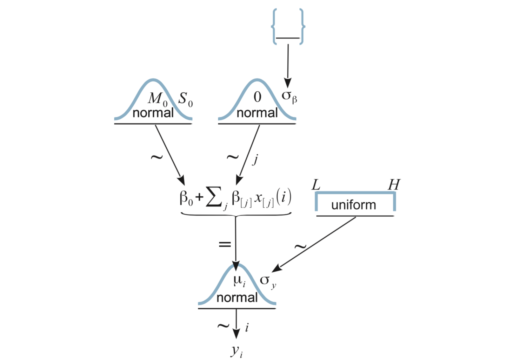

# Nominal Predictors

## Fruit flies Study

```{r ch19-setup, include = FALSE}
library(brms)
library(CalvinBayes)
library(coda)
options(width = 100)
```

A study of fruit flies (Hanley & Shapiro, 1994) considered whether the female
companions (none, 1 pregnant, 8 pregnant, 1 virgin, or 8 virgin) is associated
with differences in longevity of males (measured in days).
<!-- (A similar study on females had already shown that female fruit flies  -->


```{r ch19-flies-look}
gf_violin(longevity ~ group, data = FruitflyReduced) %>%
  gf_jitter(width = 0.2, height = 0, alpha = 0.5) %>%
  gf_point(stat = "summary", color = "red", size = 3, alpha = 0.5, fun = mean)
```

## Model 1: Out-of-the-box

It is easy enough to ask `brm()` to fit a model for us.  Let's just give it our 
explanatory and response variables and see what happens.

```{r ch19-flies-brm, cache = TRUE, results = "hide"}
flies_brm <- brm(longevity ~ group, data = FruitflyReduced)
```

```{r ch19-flies-brm-look, fig.height = 6}
flies_stan <- stanfit(flies_brm)
flies_stan
mcmc_combo(as.mcmc.list(flies_stan))
mcmc_areas_ridges(as.mcmc.list(flies_stan), regex_pars = "b_g")
```

But what just happened?  Why do we have 5 parameters starting with `b_`? 
Our first clue comes from looking at the data that get sent to Stan.

```{r ch19-standata}
standata(flies_brm) %>% lapply(head)
```

Our `group` variable has been turned into 4 (really 5, if you count 
the intercept, which is all 1's) new 0/1 variables. So our model is 

\begin{align*}
\mathrm{longevity} &= 
  \beta_0 \cdot 1 + \beta_1 x_1 + \beta_2 x_2 + \beta_3 x_3 + \beta_4 x_4 + 
  \mathrm{noise}
  \\
  & = \beta_0 \cdot 1 + \beta_1 x_1 + \beta_2 x_2 + \beta_3 x_3 + \beta_4 x_4 + 
  {\sf Norm}(0, \sigma)
\end{align*}


where, for example, 

\begin{align*}
x_1 &= [\![ \mbox{group} = \mbox{Pregnant1} ]\!] \\
    &= \begin{cases}
          1 & \mbox{if group}   =  \mbox{Pregnant1} \\
          0 & \mbox{if group} \neq \mbox{Pregnant1}
       \end{cases}
\end{align*}

In other words the distribution of longevity is 

* ${\sf Norm}(\beta_0, \sigma)$ for the `None0` group
* ${\sf Norm}(\beta_0 + \beta_1, \sigma)$ for the `Pregnant1` group
* ${\sf Norm}(\beta_0 + \beta_2, \sigma)$ for the `Pregnant2` group
* ${\sf Norm}(\beta_0 + \beta_3, \sigma)$ for the `Virgin1` group
* ${\sf Norm}(\beta_0 + \beta_4, \sigma)$ for the `Virgin2` group

Here are the default priors.

```{r ch19-prior-summary}
prior_summary(flies_brm)
```

* Flat improper priors for the `b_` parameters.
* t-distribution with 3 degrees of freedom for the intercept (heavier tails than a normal distribution)
    * Note: This is really a prior for $\alpha_0$, not $\beta_0$ since it is usually easier to 
    specify a prior for $\alpha_0$.  If for some reason we wanted to specify a prior for $\beta_0$ 
    instead, there is a little trick: use the formula `longevity ~ 0 + intercept + group`.
    * If you are curious where 58 and 18 came from, here's a good guess:
    
    ```{r ch19-defaults-for-intercept-prior}
    df_stats(~ longevity, data = FruitflyReduced, mean, sd)
    ```
   
    
    That is, the prior says that the mean response at the mean value of the predictor (in the data) 
    should be roughly the mean value of the responsss in the data, and our uncertainty is on the scale
    of the variability in responses in the data.
    
* "T" for `sigma`.  (This is really a "half t", since Stan knows the parameter must be positive.)

<!-- * "Gamma" distribution for `nu`.  Exponential is Gamma with shape = 1, `brm()` uses -->
<!-- shape = 2 by default.  (This gets truncated to the values above 1 by Stan.) -->

<!--     ```{r ch19-gamma-params} -->
<!--     gf_dist("gamma", shape = 2, rate = 0.1) %>%  -->
<!--       gf_lims(x = c(1, 50)) -->
<!--     ``` -->


## Model 2: Custom Priors

The out-of-the-box model above differs from the basic model in *DBDA*.

```{r ch19-fig19-2, echo = FALSE, out.width = "70%", fig.align = "center"}

```


We can get closer to the *DBDA* model using this:

```{r ch19-flies2-brm, cache = TRUE, results = "hide"}
flies2_brm <- 
  brm(longevity ~ group, data = FruitflyReduced,
      prior = c(
        set_prior(class = "Intercept", "normal(60, 100)"),  # 100 = 5 * 20
        set_prior(class = "b", "normal(0, 10)"),  # group = "b" is default; could be omitted
        set_prior(class = "sigma", "uniform(20.0/1000.0, 20.0 * 1000.0)")
      )
  )
prior_summary(flies2_brm)
stancode(flies2_brm)
```

This still isn't exactly the same as the model used by Kruschke. It turns out that there 
are multiple ways to code the $\beta$s.  The model we just fit and one more are easy to do 
with `brm()`. A third is used by Kruschke and takes a bit more work to fit using `brm()`.

## Models 3 and 4: alternate parameterizations

If we remove the intercept in the `brm()` model, we get a model with a $\beta_i$ for each group
mean rather than $\beta_0$ for the first group and $\beta_i$ for the difference in group means
when $i > 0$:


```{r ch19-flies3-brm, cache = TRUE, results = "hide"}
flies3_brm <- 
  brm(
    longevity ~ 0 + group, data = FruitflyReduced,
    prior = c(
      set_prior(class = "b", "normal(60, 10)"),  # group = "b" is default; could be omitted
      set_prior(class = "sigma", "uniform(20.0/1000.0, 20.0 * 1000.0)")
    ),
    sample_prior = TRUE
  )
prior_summary(flies3_brm)
stancode(flies3_brm)
```

This is equivalent to

\begin{align*}
\mathrm{longevity} &= 
  \beta_0 x_0 + \beta_1 x_1 + \beta_2 x_2 + \beta_3 x_3 + \beta_4 x_4 + 
  \mathrm{noise}
  \\
  & = \beta_0 x_0 + \beta_1 x_1 + \beta_2 x_2 + \beta_3 x_3 + \beta_4 x_4 + 
  {\sf Norm}(0, \sigma)
\end{align*}


where, for example, 

\begin{align*}
x_1 &= [\![ \mbox{group} = \mbox{Pregnant1} ]\!] \\
    &= \begin{cases}
          1 & \mbox{if group}   =  \mbox{Pregnant1} \\
          0 & \mbox{if group} \neq \mbox{Pregnant1}
       \end{cases}
\end{align*}

In other words the distribution of longevity is 

* ${\sf Norm}(\beta_0, \sigma)$ for the `None0` group
* ${\sf Norm}(\beta_1, \sigma)$ for the `Pregnant1` group
* ${\sf Norm}(\beta_2, \sigma)$ for the `Pregnant2` group
* ${\sf Norm}(\beta_3, \sigma)$ for the `Virgin1` group
* ${\sf Norm}(\beta_4, \sigma)$ for the `Virgin2` group

Kruschke uses an overspecified model that has 6 parameters: an intercept and 5 "offsets".
An extra step has to be included to properly specify the model. His model is designed so 
that $\beta_0$ is an overall average and the other $\beta_i$'s give differences to that 
overall average.

I haven't figured out if there is an easy way to do this with `brm()`.
But with a little work, we can force it. The key to doing this is the use 
of `stanvar()` to create additional lines of code that are injected into the 
Stan code. We use `scode` to give the desired code (as a string) and 
`block` to say which Stan block to put it in.

```{r ch19-flies-kruschke-constraint, cache = TRUE, results = "hide"}
FruitflyReduced <-
  FruitflyReduced %>% mutate(one = 1)
flies4_brm <- 
  brm(
    longevity ~ 0 + one + group, data = FruitflyReduced,
    prior = c(
      set_prior(coef = "one", "normal(60,10)"),
      set_prior(class = "b", "normal(0, 10)"),  # group = "b" is default; could be omitted
      set_prior(class = "sigma", "uniform(20.0/1000.0, 20.0 * 1000.0)")
    ),
    sample_prior = TRUE,
    stanvars = 
      c(
        # compute the average average
        stanvar(scode = "  real a_one = mean(b[2:K]) + b[1];", block = "genquant"),
        # compute the offsets to the average average
        stanvar(scode = "  vector[K - 1] a = b[1] + b[2:K] - a_one;", block = "genquant")
      )
  )
prior_summary(flies4_brm)
stancode(flies4_brm)
```

```{r ch19-kruschke-compare, fig.height = 6}
mcmc_areas(as.mcmc.list(stanfit(flies4_brm)), regex_pars = c("a_one", "a\\[", "^b_"))
```

As we can see, the modes of the posteriors for the `a` and `b` parameters are similar 
(because the prior on `b_one` kept `b_one` from drifting too far from where
`a_one` is centered), but the posteriors for the `a` parameters are significantly 
narrower, so the conversion from `b`'s to `a`'s is important.

## Comparing groups

### Comparing to the "intercept group"

Let's return to model 2. 

```{r ch19-flies2-redo-stanfit}
stanfit(flies2_brm)
```


In this model, one group corresponds to the intercept of the model, 
and comparisons of other groups to this group is a matter of investigating
the posterior distribution of one of the other $\beta$'s.


```{r ch19-flies-post}
flies_post <- posterior(flies_stan)
names(flies_post)
```

```{r ch19-flies-virgin1}
plot_post(flies_post$b_groupPregnant1)
hdi(flies_post$b_groupPregnant1)
plot_post(flies_post$b_groupVirgin1)
mcmc_areas(as.mcmc.list(flies_stan), pars = "b_groupVirgin1", prob = 0.95)
hdi(flies_post$b_groupVirgin1)
```

### Comparing others pairs of groups

What if we want to compare the `Virgin1` and `Virgin8` groups?
We can use the identity $\beta_0 + \beta_i - (\beta_0 + \beta_j) = \beta_i - \beta_j$ 
to simplify the algebra and do it this way.  (The same would work in model 3 or 4 as well.)

```{r ch19-virgin1-v-virgin8}
flies_post <-
  flies_post %>% mutate(dVirgin = b_groupVirgin8 - b_groupVirgin1)
plot_post(flies_post$dVirgin, xlab = "Virgin8 - Virgin1")
```

### Contrasts: Comparing "groups of groups"

What if we want to compare the two virgin groups to the 3 other groups?
This is a bit simpler to do using the model without an intercept term.

```{r ch19-flies3-contrast}
flies3_post <- posterior(flies3_brm)
names(flies3_post)
flies3_post <-
  flies3_post %>% 
  mutate(
    contrast = 
      (b_groupVirgin8 + b_groupVirgin1)/2 - 
      (b_groupPregnant1 + b_groupPregnant8 + b_groupNone0) / 3
)
plot_post(flies3_post$contrast, xlab = "Virgin vs non-virgin groups")
```

The expression

\begin{align*}
\frac{\mu_3 + \mu_4}{2} - \frac{\mu_0 + \mu_1 + \mu_2}{3}
&= 
-\frac13 \mu_0 -\frac13 \mu_1 -\frac13 \mu_2 + \frac12 \mu_3 + \frac12 \mu_4
\end{align*}

is an example of a **contrast**.  A contrast is simply a linear combination of the 
group means such that the sum of the coefficients is 0. Many interesting relationships 
can be investigated using contrasts, and the brms package includes the `hypothesis()` 
function to help us do this. (Note: because we included `sample_prior = TRUE` in the 
call to `brm()` for this model, the plot below shows both prior and posterior distributions
for the contrast.)

```{r ch19-hypothesis}
h <-
  hypothesis(
    flies3_brm,
    "(groupVirgin8 + groupVirgin1) / 2 < 
      (groupPregnant1 + groupPregnant8 + groupNone0) / 3"
  )
h
plot(h)
```


#### Multiple Hypotheses at once

We can even test multiple hypotheses at once.

```{r ch19-hypothesis2}
h2 <-
  hypothesis(
    flies3_brm,
    c("groupVirgin1 < (groupPregnant1 + groupPregnant8 + groupNone0) / 3",
      "groupVirgin8 < (groupPregnant1 + groupPregnant8 + groupNone0) / 3")
  )
h2
plot(h2)
```

#### Equality or inequality?

In the previous example, we expressed our contrast as an inequality.  We can also express it
as an equality. The output that we get from `hypothesis()` is a bit different if we do so.

```{r ch19-hypothesis3}
h3 <-
  hypothesis(
    flies3_brm,
    c("groupVirgin1 = (groupPregnant1 + groupPregnant8 + groupNone0) / 3",
      "groupVirgin8 = (groupPregnant1 + groupPregnant8 + groupNone0) / 3")
  )
h3
plot(h3)
```

* The CI is 2-sided rather than 1-sided.
* Evidence Ratio is defined differently.
    * For inequalities, this is the ratio of the posterior probabilities 
    for the inequality being true vs. false
    * For equalities, this is the ratio of the posterior density (of the equality
    holding) to the prior density.  (This only works if `sample_prior = TRUE` since 
    prior samples are required to make the calculation.)

## More Variations

The models we have looked at above are very similar to a traditional ANOVA model, the key 
features of which are 

* normal distributions for each group (normal noise), and
* same standard deviation in each group (homoskedasticity).

In frequentist statistics, these are largely chosen for convenience (the
mathematics is much easier). But we can easily relax these restrictions using
Bayesian software. Let's fit a model using

* t distributions instead normal distributions for the noise.

    This will make the results more robust against outliers in our sample 
    or distributions with heavier tails.
    
* different standard deviation parameters for each group.

Both are easy to do with `brm()`.  The main new feature is the use
of `bf()` to provide two formulas.  The first describes the mean response (separate
means for each group).  The second formula describes `sigma` (separate values for
each group).  The rest should look familiar.

```{r ch19-flies5-brm, cache = TRUE, results = "hide"}
flies5_brm <- 
  brm(
    bf(longevity ~ 0 + group, sigma ~ 0 + group),
    data = FruitflyReduced,
    family = student(),   # t distribution for the noise
    prior = c(
      set_prior(class = "b", "normal(60, 10)")
    ),
    sample_prior = TRUE
  )
```

The Stan code for this model includes the following model section.

```{stan, eval = FALSE, output.var = "flies5_model"}
model {
  vector[N] mu = X * b;
  vector[N] sigma = X_sigma * b_sigma;
  for (n in 1:N) {
    sigma[n] = exp(sigma[n]);
  }
  // priors including all constants
  target += normal_lpdf(b | 60, 10);
  target += gamma_lpdf(nu | 2, 0.1)
    - 1 * gamma_lccdf(1 | 2, 0.1);
  // likelihood including all constants
  if (!prior_only) {
    target += student_t_lpdf(Y | nu, mu, sigma);
  }
}
```

Note that the values of `sigma` are on the log scale and are converted (via `exp()`)
to the natural scale before using them in the likelihood function.
The sort of encoding of groups is used for (log) `sigma` as was used for the 
group means. Because we included `0` in our formula, we get a (log) `sigma` for 
each group.
This is reported in the summary output for the brm model as a log link for sigma.

```{r ch19-flies5-log-link}
flies5_brm
```


```{r ch19-flies5-sigmas}
mcmc_areas_ridges(as.mcmc.list(stanfit(flies5_brm)), regex_pars = "sigma")
```


In this case, it doesn't appear that there is a large difference among
the (log) standard deviations in the five groups, but it is noteable 
that the group with the lowest longevity also has the smallest standard 
deviation.  It is not uncommon for variability to larger when values are 
larger.  Fortunately, it is no harder to fit a model with separate
standard deviations than with one standard deviation for all of the groups.
And if there substantial differences in the standard deviations,
a model that takes that into account will perform better.

If we prefer to see the standard deviations on the natural scale, we can 
tell Stan to compute and store those values.  The naming isn't quite as nice,
however.

```{r ch19-flies5a, results = "hide", cache = TRUE}
flies5a_brm <- 
  brm(
    bf(longevity ~ 0 + group, sigma ~ 0 + group),
    data = FruitflyReduced,
    family = student(),   # t distribution for the noise
    prior = c(
      set_prior(class = "b", "normal(60, 10)")
    ),
    sample_prior = TRUE,
    stanvars = 
      stanvar(
        scode = "vector[K_sigma] b_rsigma = exp(b_sigma);",
        block = "genquant")
  )
```

```{r ch19-flies5a-rsigma}
flies5a_stan <- stanfit(flies5a_brm)
mcmc_areas_ridges(as.mcmc.list(flies5a_stan), regex_pars = "rsigma")
hdi(posterior(flies5a_stan), regex_pars = "rsigma")
```

## Exercises {#ch19-exercises}

1. It turns out that larger fruit flies tend to live longer.
we can take this into account by adding `thorax` (the length of each 
fruit fly's thorax in mm) to our model. Since we are primarily interested 
in the association between `group` and longevity, `thorax` is referred
to as a **covariate**.  But if we were primarily interested in the relationship
between longevity and size, we could use the same model and call `group`
the covariate.  Same model, different focus.

    Fit two models: Let Model 1 be the model below and let Model 2 be
    one just like it but without `thorax`. Then answer the questions that follow.
    We'll stick with the default priors for now, but it would be easy enough
    to choose your own.
    
    ```{r ch19-flies6, eval = FALSE}
    model1_brm <-
      brm(
        bf(longevity ~ group + thorax, sigma ~ group + thorax),
        data = FruitflyReduced, 
        family = student(),
      )
    ```

    a. Does Model 1 think that longevity is different for large and small
    fruit flies?  How do you know? How can you quantify your answer?
    
    b. We are primarily interested in whether the fruit flies that live with
    virgin females live less long than the others (those that live
    alone or with pregnant females). 
    Using each model, compute a 95% HDI for the contrast that measures this. 
    For Model 1, does it matter what value `thorax` has? (If yes, use `thorax = 0.8`
    as an example.)
    How do the two HDI's compare? Why?
    
    c. Using each model, compute a 95% HDI for 
    the contrast that compares just the Virgin1 flies to the three types of controls
    (None0, Pregnant1, and Pregnant8). How do the two models compare?
    
    d. Now compare the values for `sigma` in the two models.  To do this, we
    will need to specify both the group and the thorax size (since for different
    combinations of these the models estimate different values of `sigma`). For
    each of the combinations below, compute a 95% HDI for `sigma` in two models,
    one with `thorax` and one without. Don't forget to convert to the natural
    scale.  (Recall that `brm()` uses a log link for `sigma`.)
    
        i.  group: Pregnant1; thorax: 0.7mm, 0.8mm, 0.9mm [That's three different HDI's
        for Model 1 and the same HDI 3 times for Model 2.]
        ii. group: Virgin8; thorax: 0.7mm, 0.8mm, 0.9mm
        
        How do the results compare for the two models?
        
    e. Given the results above, is it important to include `thorax` in the model?
    Explain.
        
    f. Bonus (optional): Create a plot that shows the HDIs for `sigma` for every
    combination of model, group, and thorax measurement of 0.6, 0.7, 0.8, or 0.9 mm.


    
    
